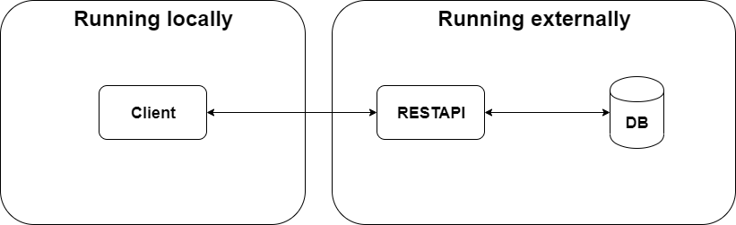
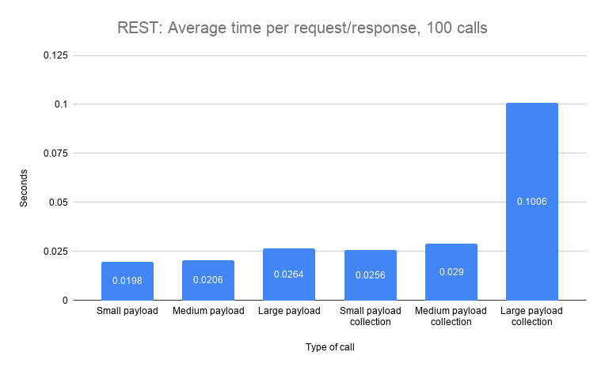
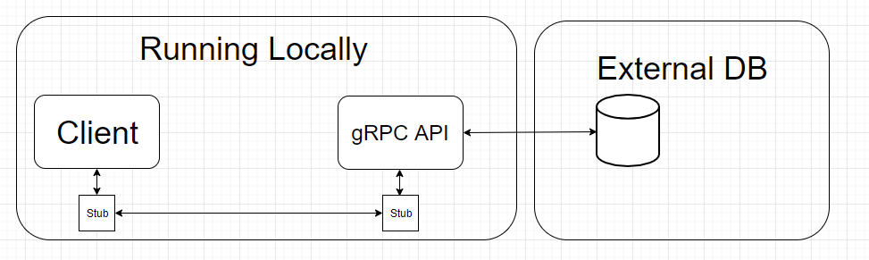
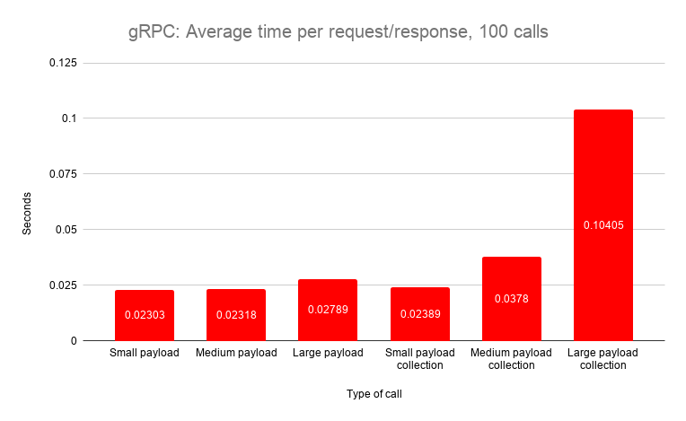
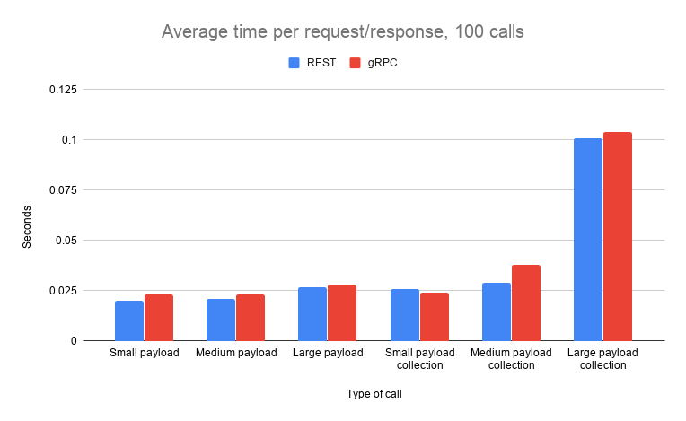

# gRPC vs. REST

## Abstract
In a world with an ever growing amount of application utilizing Microservices, gRPC claims to be faster and more stable than REST. Microservices can be heavily dependant on eachother, which means speed and stability is key. When gRPC claims to be faster than REST, why isn't it the de facto standard? In this blog we will put gRPC and REST head to head, to see which is actually faster.

## Introduction
**gRPC is a supperior techonology to REST!** Atleast that is what [this](https://code.tutsplus.com/tutorials/rest-vs-grpc-battle-of-the-apis--cms-30711), [this](https://medium.com/@bimeshde/grpc-vs-rest-performance-simplified-fd35d01bbd4), [this](https://www.yonego.com/nl/why-milliseconds-matter/#gref) and [this blog](https://medium.com/@EmperorRXF/evaluating-performance-of-rest-vs-grpc-1b8bdf0b22da) claims. According to all of the mentioned blogs, gRPC performs better and faster than a REST on several metrics. In this blog we will test specifically, how fast a REST client can handle different request and responses, and compare it to how fast a similar gRPC client handles the same requests and responses.

### Problem statement
*Is gRPC faster than REST?*

## Hypothesis
*We will assume that gRPC is able to send and recieve requests faster than a tradiational REST.*

## The experiment
To test our Hypothesis we will set up an experiment with gRPC and a REST API.
These experiments has to adhere to the following:

**Rules**
* To ensure accurate measurements, the results must be obtained from the same computer.
* Multiple data structures should be tested.
* The setup for both Apis has to be as similar as possible.
* The time used for measuring should be obtained from the client.

**Set up**
* to adhere to the multiple data structures rule, there will be a database which will feed us, single instances of an object, and feed us multiple instances of objects we can turn into a list.
* Each API will have six methods to call. 
    * three for a single instance which takes a parameter of Id.
        * each one with a larger payload
    * three for a collection of 100 instances, which takes no parameters.
        * each one with a larger payload
* Each API will be tested with a client written in C# as a console app.
    * Time will be measured with .NET Stopwatch.
    * the stopwatch will begin when the method is called and end when the API returns the full data.
* To get an average time, each operation will be executed 100 times. this result with be the one we conclude on.

**Specs**

I7-9700k, 8 core, _4.6GHz_
Samsung SSD 840 EVO 250GB
NVIDIA GeForce GTX 20170
2x8GB HyperX Fury 2666MHz DDR4 Memory

## REST
### What is REST?
We have decided to work with the common implementation of REST and not the full implementation of a RESTful API; the differences can be found in [this blog.](https://blog.ndepend.com/rest-vs-restful/)

The key features to take note of when using rest:

**Separation of client and server** 
 * Server and client can be implemented independently without knowing each other-
 * Server code can be changed without affecting the client.
 * Client code can be changed without affecting the server.
 * Both server and client are aware of methods available.

**Statelessness**
 * [Stateless](https://restfulapi.net/statelessness/) means that the server is not required to know the current state of the client and vice versa.
 * Either end can understand any method calls, without knowing the previous called methods.
    
**Invocation**
* We invoke a method on the server via [HTTP operations](https://www.restapitutorial.com/lessons/httpmethods.html)
   * GET
   * POST
   * PUT
   * DELETE

## Setting up the experiment for the REST API
The architecture for this experiment is a simple one:

## Sample project and metrics
If you want to replicate this experiment yourself, database setup can be found [here](https://github.com/mikkelertbjerg/gRPC-vs-REST/tree/master/Database-scripts) and sourcecode for the rest-api can be found [here](https://github.com/mikkelertbjerg/gRPC-vs-REST/tree/master/RestForBlog2)

Running our setup yielded these results:

The difference between a single small payload and a single large payload is small in the context of a daily task. A single small payload has a mean response time of 0.0198 whilst a single large payload has a mean response time of 0.0206 seconds. But in relation to each other its a 33% increase in response time. 

To put this into perspective a small payload contains 9 values of data.
A large payload contains (3+(6*9))*6+3 or 345 values. This means that we have requested 3733,33% more data and it only took 4.04% longer.

When we compare collections, the difference becomes very apparent. A small collection payload averaged at 0.0256 seconds and a large averaged at 0.1006 seconds, That is an increase of 293%. It is apparent that when it comes to moving large collections of data over the REST API, it takes a considerate amount of time compared to smaller collections.

## gRPC
### What is gRPC?
[gRPC](https://grpc.io/) is an open source RPC framework, that can run in any environment. gRPC was recently included in the .Net core platform thereby easily accessible by thousands of developers.

Some of the key features we would like to highlight:

**HTTP/2 support**

[HTTP/2](https://en.wikipedia.org/wiki/HTTP/2) is HTTP/1's sucessor, which is what most website and frameworks utilize today. In many ways HTTP/2 is an imporved version of HTTP/1, and HTTP/3 is already in the works.

**Language independant**

gRPC is language independant, which means it doesn't matter which language you develop in. The framework supports a handfull of [popular languages](https://packages.grpc.io/). This is quite an advantage when you're developing microservices, which might have services developed in different languages and frameworks.

**Contract First**

gRPC is strictly [contract first](https://en.wikipedia.org/wiki/Design_by_contract) which is a design approach that works esecially well in larger development teams. It also excells when developing microservices, as a contract has exsist, before any actual implementations can be done. The contract is deisgned in the [.proto file](https://developers.google.com/protocol-buffers), which is also where gRPC gains some of its speed from, seeing as .proto files are...

**Strongly typed**

As a biproduct of a strongly typed proto file, which is used as contract between client and server, but also used as an extensible mechanism for [serialzing](https://en.wikipedia.org/wiki/Serialization) structured data. 

## Setting up the gRPC project
For the gRPC architecture we use the same as the rest, we have a client and a server running locally. The client calls the methods exposed by the proto file. The method then gets executed on the server and query the database, once the data has been obtained it replies back to the client. When the client has received all the data, we stop and log the time elapsed since the call started.

### Sample project and metrics
If you want to replicate this experiment yourself database setup can be found [here](https://github.com/mikkelertbjerg/gRPC-vs-REST/tree/master/Database-scripts) and sourcecode for the grpc-project can be found [here](https://github.com/mikkelertbjerg/gRPC-vs-REST/tree/master/https://github.com/mikkelertbjerg/gRPC-vs-REST/tree/master/GrpcProject)

Running our setup yielded us these results:

The average difference between a single small payload and a single large payload, is 0.0048. Specifically the small payload took 0.02303 seconds and the large took 0.02789 seconds, that is an increase of 21.1%. 

Collections paint a different picture, a small payload collection took on average 0.02389 seconds to complete, while a collection of large payloads took 0.10405 seconds to complete. The difference between the large and small collection being 10 milliseconds or a 335.54% increase. 

## possible errors
* Both the client and server was running on the same computer, potentially competing for resources.
* We have been able to get better results if we disabled server side logging in the gRPC project.

This was run locally it is possible that the results would be different if they were run against a server on the internet.

## Conclusion

When we put the two charts next to each other, it's easy to see which one has an edge, albeit being a small one.

We hypothesized that gRPC would be faster than rest, based on the numerous blogs claiming this to be true, with their own tests. Our tests adds to the opposite being true.

Specifically when calling single instances of payloads REST was on average 13% faster. When calling collections Rest was on average 11% faster.

These results might not seem as much, but it has been [proven](https://www.hobo-web.co.uk/your-website-design-should-load-in-4-seconds/) that people on average don't wait around for data to load and will abandon a webpage or program if loading times are too long. So when moving large amounts of data, those 11% can make the difference between keeping or loosing a customer.

this prompts the question: **When to use gRPC and when to use REST**

We would argue that gRPC fit into a setting, where you need to have multiple programs or services talking to each other across different languages, especially when the tasks that needs to connected to an endpoint is an action that needs to be executed; one such action could be TurnOnTheWater().

A rest on the other hand operates on the four aforementioned HTTP operations, these operations indicated data transfers of one sort or the other. While a rest can execute the same actions as gRPC, the action TurnOnTheWater() doesn't fit into what a REST API was designed for. We would instead use REST where we required data transfers and other typical CRUD mechanics.

## References
### gRPC v REST
1. <https://code.tutsplus.com/tutorials/rest-vs-grpc-battle-of-the-apis--cms-30711>
2. <https://medium.com/@bimeshde/grpc-vs-rest-performance-simplified-fd35d01bbd4>
3. <https://www.yonego.com/nl/why-milliseconds-matter/#gref>
4. <https://medium.com/@EmperorRXF/evaluating-performance-of-rest-vs-grpc-1b8bdf0b22da>

### REST
1. <https://blog.ndepend.com/rest-vs-restful/>
2. <https://restfulapi.net/statelessness/>
3. <https://www.restapitutorial.com/lessons/httpmethods.html>

### gRPC
1. <https://grpc.io/>
2. <https://packages.grpc.io/>
3. <https://developers.google.com/protocol-buffers>

### Wiki
1. <https://en.wikipedia.org/wiki/HTTP/2>
2. <https://en.wikipedia.org/wiki/Design_by_contract>
3. <https://en.wikipedia.org/wiki/Serialization>

### Others
1. https://www.hobo-web.co.uk/your-website-design-should-load-in-4-seconds/

## Technology used

[gRPC](https://gRPC.io/)

[.Net Web Api](https://dotnet.microsoft.com/apps/aspnet/apis)

[.Net console app](https://docs.microsoft.com/en-us/visualstudio/get-started/csharp/tutorial-console?view=vs-2019)

[MySql Database](https://www.mysql.com/)

## About the authors
**Mikkel Wexøe Ertbjerg**

_AP computer science grad._

_Currently pursuing a bachelor in software development._

can be contacted on MAIL

**Nikolai Dyring Jensen**

_AP computer science grad._

_Currently pursuing a bachelor in software development._

can be contacted on Nikodyring@gmail.com

**Nikolai Sjøholm Christiansen**

_AP computer science grad._

_Currently pursuing a bachelor in software development._

can be contacted on Nikolaiviby3@gmail.com
