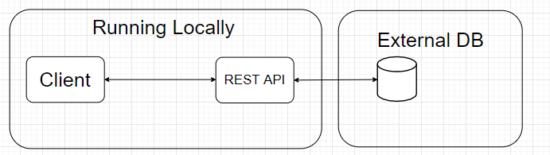
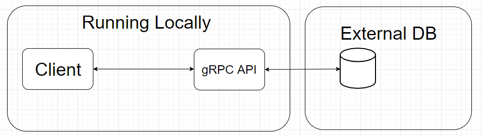

# gRPC vs. REST

## Abstract
In a world with an ever growing amount of Microservices, gRPC claims to be faster and more stable than REST. Microservices can be heavily dependant on eachother, which means speed and stability is key. When gRPC claims faster than REST, why isn't it the de facto standard? In this blog we will put gRPC and REST head to head, to see which is actually faster.

## Introduction
According to _[this blog](https://medium.com/@EmperorRXF/evaluating-performance-of-rest-vs-grpc-1b8bdf0b22da)_, gRPC is roughly 7 times faster than a REST API, when fetching data. We intend to put this to the test, with extensive testing of our own, everything programmed by us and running in a controlled environment.
### Problem statement
*Is gRPC faster than REST*

## Hypothesis
*We will assume that gRPC is able to send and recieve requests faster than a tradiational REST.*

## The experiment
To test our Hypothesis we will set up an experiment with gRPC and a Rest API.
These experiments has to adhere to the following.

**Rules**
* To ensure accurate measurements, the results must be obtained from the same computer.
* Multiple data structures should be tested.
* The setup for both Apis has to be as similar as possible.
* The time used for measuring should be obtained from the client.

**Set up**
* to adhere to the multiple data structures rule, there will be a database which will feed us, single instances of an object, and feed us multiple instances of an object which we can turn into a list.
* Each API will have 2 methods to call. 
    * one for a single instance which takes a parameter of Id.
    * one for a collection of instances, more specifically a 100 instances.
* Each API will be tested with a client written in C# as a console app.
    * Time will be measured with a .NET Stopwatch.
    * the stopwatch will begin when the method is called and end when the API returns the full data.
* To get an average time, each operation will be executed 100 times. this result with be the one we conclude on.

## REST

### _*What is REST*_
For this blog, we have decided to work with the common implementation of REST and not the full implementation of a RESTful API; the differences can be found in [this blog.](https://blog.ndepend.com/rest-vs-restful/)

The key features to take note of when using rest:
* **Separation of client and server** 
    * Which is to say that our server and client can be implemented independently without knowing each other and that we can change the code on the server or client without affecting the other seamlessly.
    The key here is that each end, knows the format of the methods available.

* **Statelessness**
    * Being stateless means that the server is not required to know the current state of the client and vice versa. Either end can understand any method calls, without knowing the previous called methods. You can read more about statelessness [here](https://restfulapi.net/statelessness/).
* **Invocation**
    * We invoke a method on the server via HTTP operations
    * GET - POST - PUT - DELETE
    * We believe them to be rather self explanatory but if you wanna read more about HTTP operations you can do so [here](https://www.restapitutorial.com/lessons/httpmethods.html)

## Setting up the experiment for the REST API

The architecture for this experiment is a simple one:

The REST API exposes two endpoints, one for a single instance of an object and one for a collection of 100 instances of objects.

the objects are of the class ObjectModel and contains 2 properties:
* Id
* Str_value

all of this is saved in a database, hosted on a website belonging to a member of the experiment.

both of these endpoints will be called a 100 times, from the client from which we can measure the results.

The host computer is a **I7-9700k** which has 8 cores running _3.6/4.9 GHz_

## Sample project and metrics
If you want to replicate this yourself, we have included the Github link below to all the relevant code, we have also included an sql schematic so that you can setup the database exactly like we had it.

## gRPC

### _*what is gRPC?*_

gRPC is an open sourced RPC framework, that can run in any environment. gRPC was recently included in the .Net core platform thereby easily accessible by thousands of developers. You can read more about gRPC [Here](https://grpc.io/).

Some of the key features we would like to highlight:

* **Framework over Http/2**
    * What this means is that, gRPC is language independent. You could take a javascript project and have it implement methods from a C# project as if it was its own methods.
* **Contract First**
    * All programs implement a contract in the form of a protobuffer file, which contains the necessary information, a so called contract first principal. This principal allows teams to work in parallel on different projects implementing the contract.
* **Strongly typed**
    * gRPC is strongly typed which attributes to its speed; this is due to how it deals with [serialization](https://medium.com/@EmperorRXF/evaluating-performance-of-rest-vs-grpc-1b8bdf0b22da).

## Setting up the gRPC project

For the gRPC architecture we use pretty much the same as for the rest, we have a client and a server running locally. The client calls the methods exposed by the proto file. The method then gets executed on the server and query the database, once the data has been obtained it replies back to the client. When the client has received all the data, we stop and log the time elapsed since the call started.

### Sample project and metrics
If you want to replicate this yourself, we have included the Github link below to all the relevant code, we have also included an sql schematic so that you can setup the database exactly like we had it.

_Should include how to reproduce for yourself_

## possible errors

Both the client and server was running on the same computer, potentially competing for resources. To fix this we encourage people who seek to reproduce our results to host their APIs before testing them, we unfortunately didn't have the possibility/foresight at the time of testing.

## Conclusion
_Metrics comapred_
_When to gRPCS_
_When to REST_

## References

## Technology used

[gRPC](https://gRPC.io/)

[.Net Web Api](https://dotnet.microsoft.com/apps/aspnet/apis)

[.Net console app](https://docs.microsoft.com/en-us/visualstudio/get-started/csharp/tutorial-console?view=vs-2019)

[MySql Database](https://www.mysql.com/)
