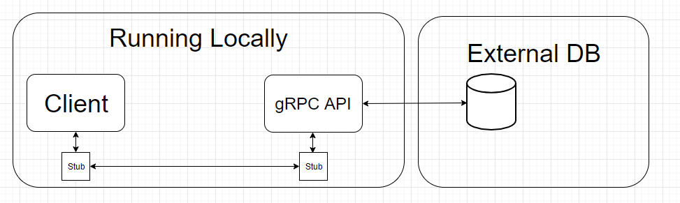

# gRPC vs. REST

## Abstract
In a world with an ever growing amount of application utilizing Microservices, gRPC claims to be faster and more stable than REST. Microservices can be heavily dependant on eachother, which means speed and stability is key. When gRPC claims to be faster than REST, why isn't it the de facto standard? In this blog we will put gRPC and REST head to head, to see which is actually faster.

## Introduction
According to _[this blog](https://medium.com/@EmperorRXF/evaluating-performance-of-rest-vs-grpc-1b8bdf0b22da)_, gRPC is roughly 7 times faster than a REST API, when fetching data. We intend to put this to the test, with extensive testing of our own, everything programmed by us and running in a controlled environment.

### Problem statement
*Is gRPC faster than REST?*

## Hypothesis
*We will assume that gRPC is able to send and recieve requests faster than a tradiational REST.*

## The experiment
To test our Hypothesis we will set up an experiment with gRPC and a Rest API.
These experiments has to adhere to the following:

**Rules**
* To ensure accurate measurements, the results must be obtained from the same computer.
* Multiple data structures should be tested.
* The setup for both Apis has to be as similar as possible.
* The time used for measuring should be obtained from the client.

**Set up**
* to adhere to the multiple data structures rule, there will be a database which will feed us, single instances of an object, and feed us multiple instances of objects we can turn into a list.
* Each API will have six methods to call. 
    * three for a single instance which takes a parameter of Id.
    * three for a collection of 100 instances, which takes no parameters.
* Each API will be tested with a client written in C# as a console app.
    * Time will be measured with .NET Stopwatch.
    * the stopwatch will begin when the method is called and end when the API returns the full data.
* To get an average time, each operation will be executed 100 times. this result with be the one we conclude on.

**Specs**
I7-9700k, 8 core, _3.6/4.9 GHz_

## REST
### _*What is REST*_
We have decided to work with the common implementation of REST and not the full implementation of a RESTful API; the differences can be found in [this blog.](https://blog.ndepend.com/rest-vs-restful/)

The key features to take note of when using rest:
**Separation of client and server** 
 * Server and client can be implemented independently without knowing each other-
 * Server code can be changed without affecting the client.
 * Client code can be changed without affecting the server.
 * Both server and client are aware of methods available.

**Statelessness**
 * Stateless means that the server is not required to know the current state of the client and vice versa.
 * Either end can understand any method calls, without knowing the previous called methods.
 * You can read more about statelessness [here](https://restfulapi.net/statelessness/).
    
**Invocation**
* We invoke a method on the server via HTTP operations
   * GET
   * POST
   * PUT
   * DELETE
* If you want to read more about HTTP operations you can do so [here](https://www.restapitutorial.com/lessons/httpmethods.html)

## Setting up the experiment for the REST API
The architecture for this experiment is a simple one:

## Sample project and metrics
If you want to replicate this experiment yourself database setup can be found [here](https://github.com/mikkelertbjerg/gRPC-vs-REST/tree/master/Database-scripts) and sourcecode for the rest-api can be found [here](https://github.com/mikkelertbjerg/gRPC-vs-REST/tree/master/RestForBlog2)

## gRPC
### _*what is gRPC?*_
gRPC is an open source RPC framework, that can run in any environment. gRPC was recently included in the .Net core platform thereby easily accessible by thousands of developers. You can read more about gRPC [Here](https://grpc.io/).

Some of the key features we would like to highlight:

**HTTP/2 support**
HTTP/2 is HTTP/1's sucessor, which is what most website and frameworks utilize today. In many ways HTTP/2 is an imporved version of HTTP/1, and HTTP/3 is already in the works. You can read more about HTTP/2 [here](https://en.wikipedia.org/wiki/HTTP/2).

**Language independant**
gRPC is language independant, which means it doesn't matter which language you develop in. The framework supports a handfull of [popular languages](https://packages.grpc.io/). This is quite an advantage when you're developing microservices, which might have services developed in different languages and frameworks.

**Contract First**
gRPC is strictly [contract first](https://en.wikipedia.org/wiki/Design_by_contract) which is a design approach that works esecially well in larger development teams. It also excells when developing microservices, as a contract has exsist, before any actual implementations can be done. The contract is deisgned in the [.proto file](https://developers.google.com/protocol-buffers), which is also where gRPC gains some of its speed from, seeing as .proto files are...

**Strongly typed**
As a biproduct of a strongly typed proto file, which is used as contract between client and server, but also used as an extensible mechanism for [serialzing](https://medium.com/@EmperorRXF/evaluating-performance-of-rest-vs-grpc-1b8bdf0b22da) structured data. 

## Setting up the gRPC project
For the gRPC architecture we use the same as the rest, we have a client and a server running locally. The client calls the methods exposed by the proto file. The method then gets executed on the server and query the database, once the data has been obtained it replies back to the client. When the client has received all the data, we stop and log the time elapsed since the call started.

### Sample project and metrics
If you want to replicate this experiment yourself database setup can be found [here](https://github.com/mikkelertbjerg/gRPC-vs-REST/tree/master/Database-scripts) and sourcecode for the grpc-project can be found [here](https://github.com/mikkelertbjerg/gRPC-vs-REST/tree/master/https://github.com/mikkelertbjerg/gRPC-vs-REST/tree/master/GrpcProject)

## possible errors
Both the client and server was running on the same computer, potentially competing for resources. We ask people who seek to reproduce our results, to keep this fact in mind. 

## Conclusion
_Metrics comapred_
_When to gRPCS_
_When to REST_

## References

## Technology used

[gRPC](https://gRPC.io/)

[.Net Web Api](https://dotnet.microsoft.com/apps/aspnet/apis)

[.Net console app](https://docs.microsoft.com/en-us/visualstudio/get-started/csharp/tutorial-console?view=vs-2019)

[MySql Database](https://www.mysql.com/)
