# gRPC vs. REST - Which is faster?
_In a world with an ever growing amount of applications utilizing Microservices, gRPC claims to be faster and more stable than REST. Microservices can be heavily dependent on each other, which means speed and stability is key. When gRPC claims to be faster than REST, why isn't it the de facto standard? In this blog we will put gRPC and REST head to head, to see which is actually faster._

**gRPC is a superior technology to REST!** At least that is what [this][1]`1`, [this][2]`2`, [this][3]`3` and [this blog][4]`4` claims. According to all the mentioned blogs, gRPC performs better and faster than a REST on several metrics. In this blog we will test specifically, how **_fast_** a REST client can handle different request and responses, and compare it to how fast a similar gRPC client handles the same requests and responses. This begs the question...

_**```Is gRPC faster than REST?```**_

*We hypothosize that gRPC is able to send and recieve requests faster than a traditional REST.* To test this, the following experiments have been developed.

## The experiment
To test the Hypothesis two experiments, one utlizing gRPC and one utilizing REST, is set up.
These experiments have to adhere to the following:

**Rules**

* To ensure accurate measurements, the results must be obtained from the same computer.
* Multiple data structures will be tested.
* The setup for both APIs has to be as similar as possible.
* The time used for measuring should be obtained from the client.

**Set up**

* to adhere to the multiple data structures rule, a local database has been created, this database will provide a single instances of an object, as well as multiple instances of objects that will be stored in a list.
* Each API will have 12 methods to call. 
    * three for a single instance which takes a parameter of Id.
        * each one with a larger payload
    * three for a single instance which takes a parameter of Id.
        * each one with a deeper payload
    * three for a collection of 100 instances, which takes no parameters.
        * each one with a larger payload
    * three for a collection of 100 instances, which takes no parameters.
        * each one with a deeper payload
* Each API will be tested with a client written in C#, as a console app.
    * Time will be measured with [.NET Stopwatch][18]`18`.
    * the stopwatch will begin when the method is called and end when the API returns the full data.
* To minimize anomalies and outliers, each operation will be executed 100 times, and the average call speed will be evaluated.

**Specs**

I7-9700k, 8 core, _4.6GHz_

Samsung SSD 840 EVO 250GB

NVIDIA GeForce GTX 1070

2x8 GB HyperX Fury 2666MHz DDR4 Memory

## REST
### What is REST?
We have decided to work with the common implementation of REST and not the [full implementation of a RESTful API][5]`5`.

The key features to take note of when using rest:

**Separation of client and server** 
 * Server and client can be implemented independently without knowing each other-
 * Server code can be changed without affecting the client.
 * Client code can be changed without affecting the server.
 * Both server and client are aware of methods available.

**Statelessness**
 * [Stateless][6]`6` means that the server is not required to know the current state of the client and vice versa.
 * Either end can understand any method calls, without knowing the previous called methods.
    
**Invocation**
* We invoke a method on the server via [HTTP operations][7]`7`
   * GET
   * POST
   * PUT
   * DELETE

## Setting up the experiment for the REST API
The architecture for this experiment is a simple one:


## Sample project and metrics
If you want to replicate this experiment yourself, database setup can be found [here](https://github.com/mikkelertbjerg/gRPC-vs-REST/tree/master/Database-scripts) and source code for the rest-api can be found [here](https://github.com/mikkelertbjerg/gRPC-vs-REST/tree/master/RestForBlog2)

Running our setup yielded the following results:

**Single payload**

The difference between a single small payload and a single large payload is small in the context of a daily task. A single small payload has a mean response time of 0.0181 whilst a single large payload has a mean response time of 0.0204 seconds. But in relation to each other it's a 12.7% increase in response time.

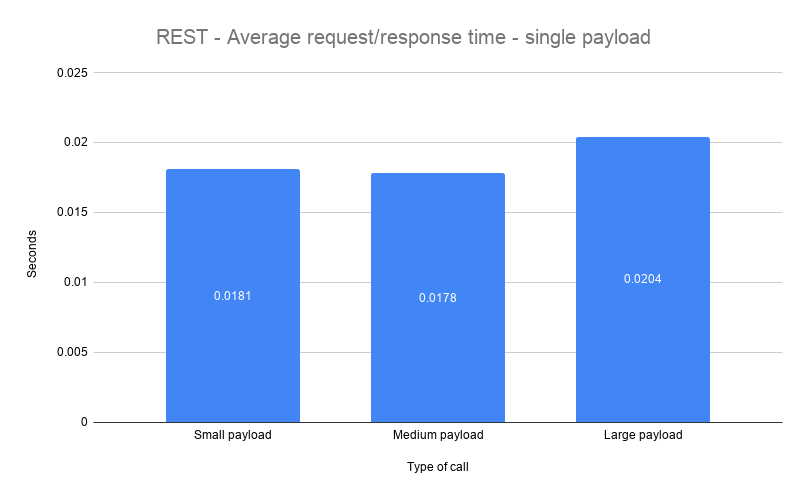

To put this into perspective a small payload contains 10 values of data.
A large payload contains (4+(6\*9))\*6+4 or 352 values. This means that we have requested 3420% more data and it only took 12.7% longer.

To test different scenarios we also created a "deep" payload which contains a different amount of nested objects. The deepest payload contains a total of eight nested objects, however the total amount of values is far less in comparison to the previous payload. The previously mentioned payload peaked at 352 values where as the deepest payload peaks at (4+(6\*4))+(4+(7\*4))+(4+(8\*4)) values, or 96 values in total. In other words the deep payloads are much smaller in size, but different in structure.

To give a concrete example, a large payload is structured like so:
```
large_payload {
    id,
    string_Value,
    int_value,
    double_value,
    medium_payload {
        id,
        string_value,
        int_value,
        double value,
        small_payload {
                id,
                string_value,
                int_value,
                double_value
            },
        small_payload {
                ...
            },
        ...
        },
    medium_payload {
            ...
        },
    ...
}
```
and the deepest_payload is structured like so:
```
deepest_payload {
    id,
    depth_seven {
        ...
    },
    depth_eight {
        ...
    },
    depth_nine {
        id,
        string_value,
        int_value,
        double_value,
        depth_eight {
            id,
            string_value,
            int_value,
            double_value,
            depth_seven {
                ...
                depth_six {
                    ...
                    dpeth_five {
                        ...
                        depth_four {
                            ...
                            depth_three {
                                ...
                                depth_two {
                                    ...
                                    depth_one {
                                        ...
                                    }
                                }
                            }
                        }
                    }
                }
            }
        }

    }
}
```

Much to our suprise, the more values, the faster the response, which might indicate possible errors during our tests, such as network outage.

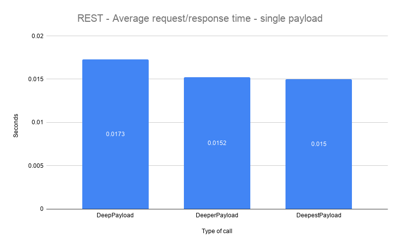

To put things into perspective, a deep payload, which contains a total of 4+(4+4)+(4+4\*2) values, or 24 values in total. Averaged at 0.0173 seconds, where as the deepest payload, which carries a total of 96 values, which means it's 300% larger in size, averaged at 0.015 seconds. In other words, 300% more data was transfered 15.3% faster on average.

**Collection of payloads**

When we compare collections, the difference becomes very apparent. A small collection payload averaged at 0.0256 seconds and a large averaged at 0.1006 seconds, That is an increase of 293%. It is apparent that when it comes to moving large collections of data over the REST API, it takes a considerate amount of time compared to smaller collections.

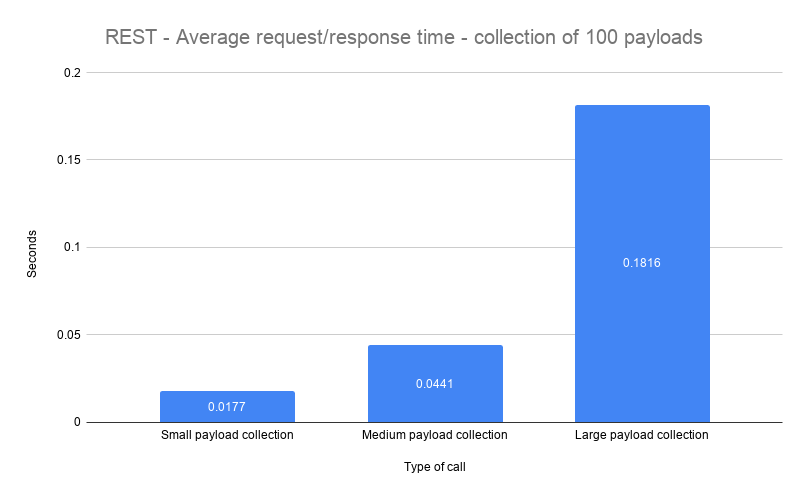

The results are very much a like when we tested on collections of deep payloads.

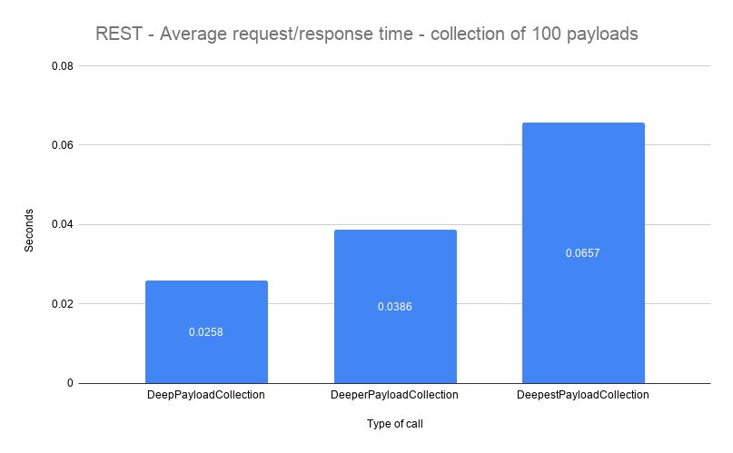

## gRPC
### What is gRPC?
[gRPC][8]`8` is an open source RPC framework, that can run in any environment. gRPC was recently included in the .Net core platform thereby easily accessible by thousands of developers.

Some key features we would like to highlight:

**HTTP/2 support**

[HTTP/2][9]`9` is HTTP/1's sucessor, which is what most website and frameworks utilize today. In many ways HTTP/2 is an imporved version of HTTP/1, and HTTP/3 is already in the works.

**Language independant**

gRPC is language independant, which means it doesn't matter which language you develop in. The framework supports a handfull of [popular languages][10]`10`. This is quite an advantage when you're developing microservices, which might have services developed in different languages and frameworks.

**Contract First**

gRPC is strictly [contract first][11]`11` which is a design approach that works esecially well in larger development teams. It also excels when developing microservices, as a contract has exsist, before any actual implementations can be done. The contract is deisgned in the [.proto file][12]`12`, which is also where gRPC gains some of its speed from, seeing as .proto files are...

**Strongly typed**
As a by-product of a strongly typed proto file, which is used as contract between client and server, but also used as an extensible mechanism for [serializing][13]`13` structured data. 

## Setting up the gRPC project
For the gRPC architecture we use the same as the rest, we have a client and a server running locally. The client calls the methods exposed by the proto file. The method then gets executed on the server and query the database, once the data has been obtained it replies to the client. When the client has received all the data, we stop and log the time elapsed since the call started.

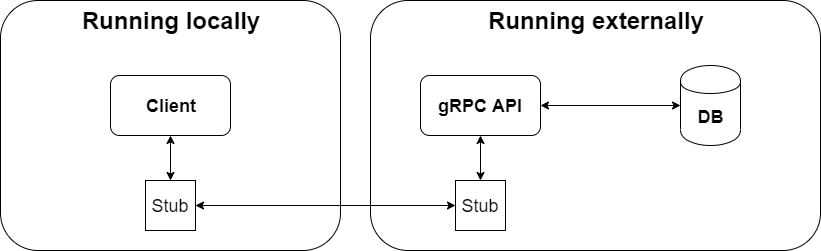

### Sample project and metrics
If you want to replicate this experiment yourself database setup can be found [here](https://github.com/mikkelertbjerg/gRPC-vs-REST/tree/master/Database-scripts) and source code for the grpc-project can be found [here](https://github.com/mikkelertbjerg/gRPC-vs-REST/tree/master/https://github.com/mikkelertbjerg/gRPC-vs-REST/tree/master/GrpcProject)

Running our setup yielded the following results results:

**Single payloads**

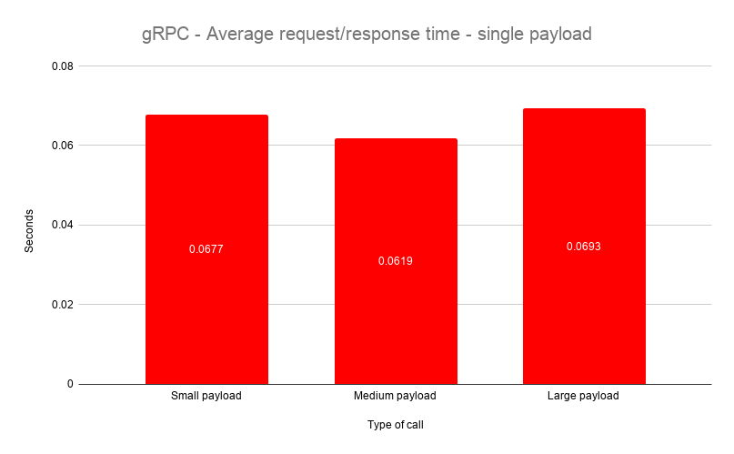

The test on single payloads yielded quite wierd results, where the medium paylod proved to be the fastest on average, and the largest payload only being slightly slower than the smallest. Just to recap the numbers; a larger payload contains 3400% more data than a small payload, and yet it only took 2.36% longer to get that data.

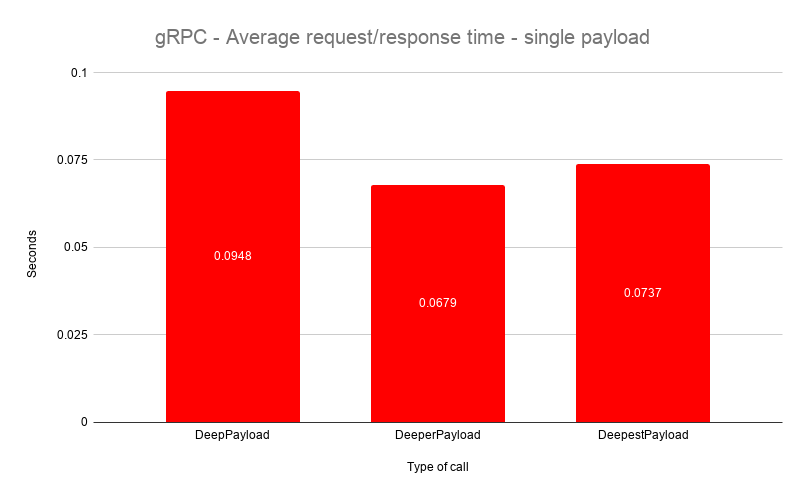

Even more wierd were the results of the deep payloads. Once again the payload containing a "medium" amount of data, was the fastest, just like previously. But unlike previously, the deepest payload was significantly faster than the deep payload, to be precise; the deepest payload, which contains 300% more data than a deep payload was 28.63% faster. As the results are rather unexpected we have to take a close look at [possible errors](#possible-errors) that could have occured.

**Collection of payloads**

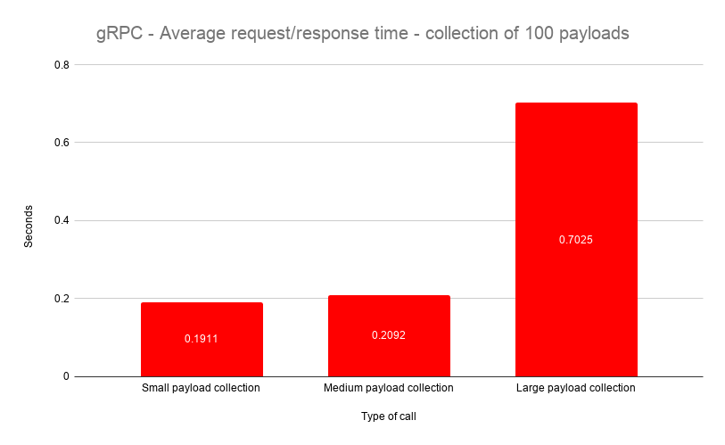

Collections paint a different picture, a small payload collection averaged at 0.01911 seconds, while a collection of large payloads took 0.7025. Which means a large payload on average took 267.6% longer to get. These results are much closer to what we would expect. We did the same test with a collection of deep payloads.

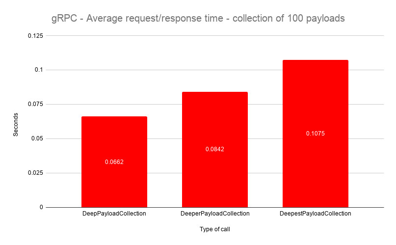

The results of this test, were as you would expect, as the payloads incrementally increase in size, they also increase incrementally in response time.

## Conclusion

When we put the two charts next to each other, it's easy to see which one has an edge.

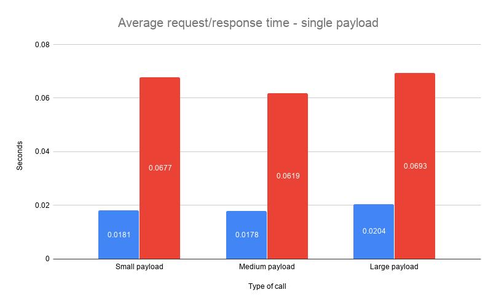
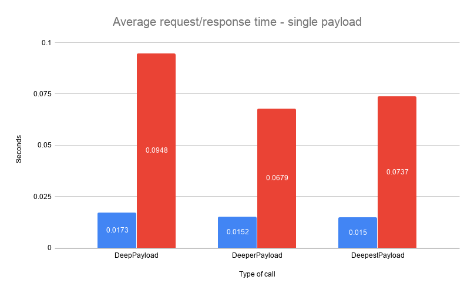

This is the case for both single instances of objects as well as collections of objects.

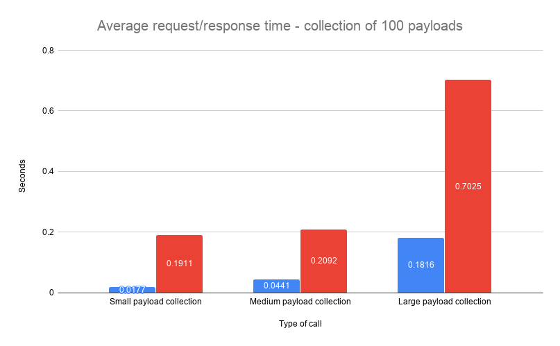
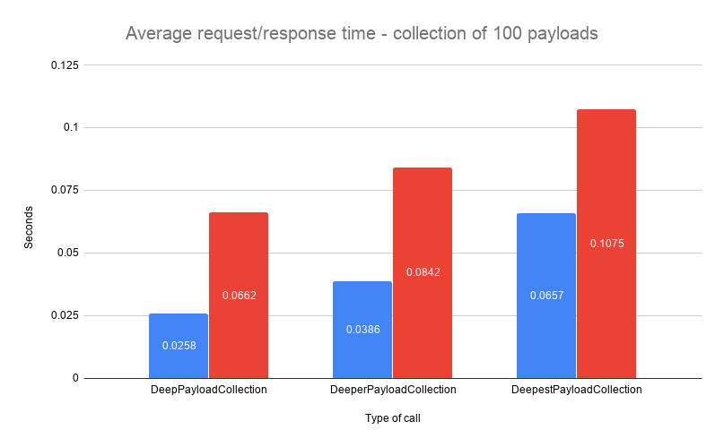

We hypothesized that gRPC would be faster than rest, based on the numerous blogs claiming this to be true, with their own tests. Our tests adds to the opposite being true.

These results might not seem as much, but it has been [proven][14]`14` that people on average don't wait around for data to load and will abandon a web page or program if loading times are too long. When moving large amounts of data, a small amount of time can be the difference between keeping or loosing a customer.

this prompts the question: **_When to use gRPC and when to use REST_**

We would argue that gRPC fit into a setting, where you need to have multiple programs or services talking to each other across different languages, especially when the tasks that needs to connected to an endpoint is an action that needs to be executed; one such action could be TurnOnTheWater().
This argument is based on the research made into gRPC, rather than the results of these particular tests.

A rest on the other hand operates on the four aforementioned HTTP operations, these operations indicated data transfers of one sort or the other. While a rest can execute the same actions as gRPC, the action TurnOnTheWater() doesn't fit into what a REST API was designed for. We would instead use REST where we required data transfers and other typical CRUD mechanics.

## possible errors
* Network outage during some of the tests
* gRPC serverside logging was set to critical, tweaking this option might yield different results.

## What's next?
This blog has been only been about the differences in speed between REST and gRPC, but in reality, many other factors are present, if we were to truly compare the two frameworks. gRPC has claimed to not only be faster, but also more reliable, stable and secure, and all of these metrics, as well as other metrics, would be interesting to cover, they are however out of scope in this particular blog.

## Technologies used
[gRPC][8]

[.Net Web Api][15]

[.Net console app][16]

[MySql Database][17]

## References
1. [Battle of the APIs][1] `gRPC v REST` 
2. [gRPC/REST perfromance simplified][2] `gRPC v REST` 
3. [Why milliseconds matter][3] `gRPC v REST` 
4. [gRPC/REST evaluating perfromance][4] `gRPC v REST` 
5. [REST vs RESTful][5] `REST` 
6. [Statelessness][6] `REST` 
7. [Http Methods][7] `REST` 
8. [gRPC][8] `gRPC` 
9. [HTTP/2][9] `wiki`
10. [Suported gRPC languages][10] `gRPC`
11. [Design by Contract][11] `wiki`
12. [Google proto buffers][12] `gRPC`
13. [Serialization][13] `wiki`
14. [Website should load in 4 seconds][14] `blog`
15. [.NET Web API][15] `.NET` 
16. [.NET Console App][16] `.NET`
17. [MySQL][17] `MySQL`
18. [.NET Stopwatch API][18] `.NET`

[1]: <https://code.tutsplus.com/tutorials/rest-vs-grpc-battle-of-the-apis--cms-30711> "Battle of the APIs"
[2]: <https://medium.com/@bimeshde/grpc-vs-rest-performance-simplified-fd35d01bbd4>   "gRPC/REST perfromance simplified"
[3]: <https://www.yonego.com/nl/why-milliseconds-matter/#gref>   "Why milliseconds matter"
[4]: <https://medium.com/@EmperorRXF/evaluating-performance-of-rest-vs-grpc-1b8bdf0b22da>  "gRPC/REST evaluating perfromance"
[5]: <https://blog.ndepend.com/rest-vs-restful/>  "REST vs RESTful"
[6]: <https://restfulapi.net/statelessness/>   "Statelessness"
[7]: <https://www.restapitutorial.com/lessons/httpmethods.html> "Http Methods"
[8]: <https://grpc.io/> "gRPC"
[9]: <https://en.wikipedia.org/wiki/HTTP/2> "HTTP/2"
[10]: <https://packages.grpc.io/> "Suported gRPC languages"
[11]: <https://en.wikipedia.org/wiki/Design_by_contract> "Design by Contract"
[12]: <https://developers.google.com/protocol-buffers> "Google proto buffers"
[13]: <https://en.wikipedia.org/wiki/Serialization> "Serialization"
[14]: <https://www.hobo-web.co.uk/your-website-design-should-load-in-4-seconds/>  "Website should load in 4 seconds"
[15]: <https://dotnet.microsoft.com/apps/aspnet/apis>  ".NET Web API"
[16]: <https://docs.microsoft.com/en-us/visualstudio/get-started/csharp/tutorial-console?view=vs-2019>   ".NET Console App"
[17]: <https://www.mysql.com/>   "MySQL"
[18]: <https://docs.microsoft.com/en-us/dotnet/api/system.diagnostics.stopwatch?view=netframework-4.8>   ".NET Stopwatch"

## About the authors
**Mikkel Wexøe Ertbjerg**

_AP computer science grad._

_Currently pursuing a bachelor in software development._

can be contacted on Mikkelertbjerg@gmail.com

**Nikolai Dyring Jensen**

_AP computer science grad._

_Currently pursuing a bachelor in software development._

can be contacted on Nikodyring@gmail.com

**Nikolai Sjøholm Christiansen**

_AP computer science grad._

_Currently pursuing a bachelor in software development._

can be contacted on Nikolaiviby3@gmail.com
